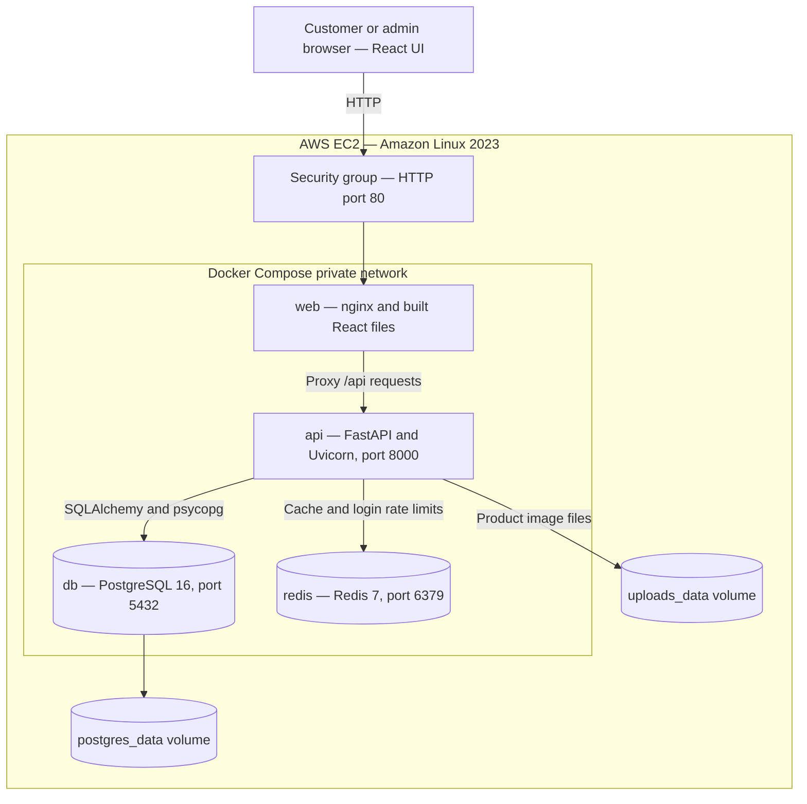

# QuickCart

[](https://github.com/MohdAsif-AIML25/quickcart-backend/actions/workflows/ci.yml)

A full-stack e-commerce application built with **FastAPI, React, PostgreSQL and Redis**, deployed on **AWS EC2 using Docker Compose**.

Customers browse products, manage a cart, and place orders with a delivery address. Admins manage products, upload images, and manage order status, estimated delivery dates, cancellations and eligible order deletions.

**Stack:** Python 3.12 · FastAPI · SQLAlchemy 2.0 · Alembic · PostgreSQL 16 · Redis 7 · JWT · React 19 · Vite · nginx · Docker Compose · GitHub Actions

> **Payment scope:** Cash on Delivery only. No online payment gateway is integrated. The application does not collect card or UPI credentials or confirm payment collection. Order status and payment status are separate.

## Demo and documentation

| Resource | Link |
|---|---|
| Recorded walkthrough | [Download the QuickCart demo video](docs/quickcart_product.mp4) |
| Screenshots | [Browse project screenshots](docs/images/) |
| AWS deployment and operations | [Deployment guide](docs/aws-deployment.md) |
| AWS frontend | [Open QuickCart](http://34.235.123.254/) |
| AWS API documentation | [Open Swagger](http://34.235.123.254/api/docs) |

The recorded demo is approximately 30 MB. Public links are available only while the demo instance is running, and its auto-assigned IP may change after an EC2 stop/start. HTTPS has not yet been confirmed for this deployment; use demo data only. Use the SSH tunnel documented in the deployment guide for entering credentials until HTTPS is configured.

The deployment work is on `feature/aws-deployment`. If browsing another branch, select that branch to see the corresponding documentation and media. Update these references if the deployment is moved to `main`.

## Features

- **Authentication:** registration, login, access and refresh tokens, and bcrypt password hashing.
- **Role-based authorization:** customer and admin permissions enforced by the backend.
- **Product catalogue:** search, category filtering, pagination, product soft deletion, and validated JPEG, PNG and WebP uploads.
- **Cart:** add products, view quantities and totals, and remove items before checkout.
- **Transactional checkout:** row-level locking coordinates stock updates and order creation. Successful checkout empties the cart.
- **Delivery details:** validated shipping address stored as a snapshot on the order.
- **Order management:** admin status changes, estimated delivery dates, cancellation before shipping, and soft deletion of confirmed orders.
- **Stock restoration:** cancellation/deletion uses order locking and a restoration marker to avoid restoring the same units twice.
- **Historical records:** order items preserve the product name and price at purchase time.
- **Redis:** product-list caching and per-IP login rate limiting.
- **Frontend:** customer and admin pages with automatic token refresh.
- **Operations:** Docker images, database migrations, health endpoints, and a GitHub Actions workflow.

## Architecture



React executes in the browser. nginx serves its static files and forwards `/api/...` requests to FastAPI, removing the prefix. In production, only the web container publishes an application port; the API, PostgreSQL and Redis have no direct host-port mappings. API endpoints remain publicly accessible through nginx, subject to authentication and authorization.

In development, the Vite server proxies `/api/...` to FastAPI. This keeps frontend API calls on the same browser origin when configured as intended.

The production API uses `UVICORN_ROOT_PATH=/api` for external URL generation, including Swagger's schema URL. nginx supplies forwarded client headers. Review proxy trust if the private network or API exposure changes.

## Project structure

| Path | Purpose |
|---|---|
| `app/api/routes/` | HTTP endpoints |
| `app/api/deps.py` | Database session, authenticated user and admin dependencies |
| `app/services/` | Product, cart, checkout, order, cache and upload logic |
| `app/models/` | SQLAlchemy models |
| `app/schemas/` | Request validation and response models |
| `app/core/` | Configuration, security, errors, logging and rate limiting |
| `alembic/` | Database migrations |
| `tests/` | Backend tests |
| `frontend/` | React source, Vite configuration, nginx configuration and Dockerfile |
| `docs/` | Deployment guide, screenshots and demo video |

## Run locally: choose one mode

Use either the full Docker stack or the development workflow. Do not start both API servers on port 8000 at the same time.

### Option A — complete application in Docker

Requirements: Docker Desktop running with Linux containers, Git, and a local `.env` file.

From the repository root in PowerShell, create `.env` only if it does not already exist:

```powershell
if (-not (Test-Path .env)) { Copy-Item .env.example .env }
```

Set the required values from `.env.example`, including a strong local JWT secret. Keep an existing `.env`; do not replace it with AWS's `.env.prod` or commit either file.

```powershell
docker compose -f docker-compose.yml config --quiet
docker compose -f docker-compose.yml up -d --build
docker compose -f docker-compose.yml ps
```

Run commands individually and stop if one fails. Local addresses configured in `docker-compose.yml`:

| Resource | Address |
|---|---|
| Frontend served by nginx | http://localhost:8080/ |
| API health through nginx | http://localhost:8080/api/health |
| Direct API documentation | http://localhost:8000/docs |

Check the `PORTS` column if your Compose mappings differ. For AWS tunnel access, use `127.0.0.1` and a free local port to avoid a conflict with the local Docker frontend.

Inspect logs or migrations:

```powershell
docker compose logs --tail=100 api web
docker compose exec api alembic current
```

The API image's startup command applies migrations with `alembic upgrade head`.

Stop the stack without removing containers:

```powershell
docker compose stop
```

Start it again:

```powershell
docker compose up -d
```

Database and uploaded image data are stored in named volumes. `docker compose down` removes containers and the Compose network but normally retains those named volumes. Avoid `down -v` and volume-pruning commands unless intentionally deleting data. Volumes are persistence, not backups.

### Option B — Python and Vite development servers

Requirements: Python 3.12, Node.js 22, Docker Desktop, and `.env` configured for the local database and Redis.

If the complete Docker stack is already running, stop its application containers first:

```powershell
docker compose stop api web
```

From the repository root:

```powershell
py -3.12 -m venv .venv
.\.venv\Scripts\Activate.ps1
python -m pip install -r requirements-dev.txt
```

Create `.env` if needed as shown above. Start only infrastructure:

```powershell
docker compose up -d db redis
docker compose ps
```

For Python running on your laptop, configure `.env` to reach PostgreSQL at `localhost:5433` and Redis at `localhost:6379`. Inside Docker, Compose instead configures the API to use service names `db:5432` and `redis:6379`. Then:

```powershell
alembic upgrade head
uvicorn app.main:app --reload
```

Swagger: http://127.0.0.1:8000/docs

In a second PowerShell terminal, from the repository root:

```powershell
cd frontend
npm install
npm run dev
```

Open the URL Vite prints, usually http://localhost:5173/. Keep both development server terminals open.

## Create an admin account

Register an account first. Registration creates a customer, not an admin. Changing a role does not change the account's password.

**Local Python development:** with the virtual environment active, run from the repository root:

```powershell
python -m scripts.promote_admin admin@example.com
```

Use the actual email you registered. The script intentionally refuses to run in production.

**Local Docker:** open PostgreSQL using the database username and name configured in your Compose file. For the documented defaults:

```powershell
docker compose exec db psql -U quickcart -d quickcart
```

At the PostgreSQL prompt, not in PowerShell:

```sql
UPDATE users
SET role = 'admin'
WHERE email = 'admin@example.com'
RETURNING id, email, role;
```

`UPDATE 1` confirms an account was updated. `UPDATE 0` means the email did not match. Exit with `\q`, then log out and log in again. Use `GET /auth/me` to verify the role.

For the AWS production database, use the commands in [the deployment guide](docs/aws-deployment.md). Local and AWS accounts are separate.

## Customer and admin walkthrough

1. As admin, create a product with stock 10 and upload an image.
2. As a separate customer, browse the catalogue and add one unit to the cart.
3. Open checkout, enter fictional delivery details, and select Cash on Delivery.
4. Submit the order. Confirm that it appears in order history, the cart is empty, and product stock becomes 9.
5. As admin, change the order to processing and set an estimated delivery date. Refresh the customer's order view to see the changes.
6. Create a separate confirmed demo order to demonstrate deletion. An eligible admin deletion hides that order and restores its stock.
7. Move the first order through shipped to delivered. Payment remains pending: delivery completion does not record cash collection.

Customers can remove cart items before checkout. They cannot cancel, delete, or change the status of placed orders.

## Order rules

| Current status | Allowed next status | Admin deletion allowed |
|---|---|---|
| `confirmed` | `processing`, `cancelled` | Yes |
| `processing` | `shipped`, `cancelled` | No |
| `shipped` | `delivered` | No |
| `delivered` | None | No |
| `cancelled` | None | No |

Invalid transitions return 409. Cancellation and eligible deletion restore stock using an order lock and `stock_restored_at` marker. Deletion is soft deletion: the row remains, but normal listings exclude it.

Delivery completion sets `delivered_at`. Cancellation clears the estimated delivery date. The estimated date cannot precede the order date or be edited on a delivered/cancelled order. Payment status does not automatically change with order status.

Older orders may have `null` address and payment fields after migration; the UI displays missing historical information rather than inventing it.

## API overview

Paths below are backend routes. On AWS, prepend `/api`, for example `/api/products`.

| Method | Path | Access | Purpose |
|---|---|---|---|
| POST | `/auth/register` | Public | Register a customer |
| POST | `/auth/login` | Public, rate limited | Issue access and refresh tokens |
| POST | `/auth/refresh` | Refresh token | Issue a new token pair |
| GET | `/auth/me` | Authenticated | Current account and role |
| GET | `/products` | Public | Paginated, searchable catalogue |
| GET | `/products/{id}` | Public | One active product |
| POST | `/admin/products` | Admin | Create product |
| PATCH | `/admin/products/{id}` | Admin | Update product |
| DELETE | `/admin/products/{id}` | Admin | Soft-delete product |
| POST | `/admin/products/{id}/image` | Admin | Upload product image |
| GET | `/cart` | Authenticated | Own cart |
| POST | `/cart/items` | Authenticated | Add product to cart |
| DELETE | `/cart/items/{id}` | Authenticated | Remove own cart item |
| POST | `/orders/checkout` | Authenticated | Place order with address and payment method |
| GET | `/orders/me` | Authenticated | Own orders |
| GET | `/orders/{id}` | Owner | One own order |
| GET | `/admin/orders` | Admin | Orders not soft-deleted |
| PATCH | `/admin/orders/{id}` | Admin | Change status or estimated delivery date |
| DELETE | `/admin/orders/{id}` | Admin | Soft-delete a confirmed order |
| GET | `/health` | Public | Process liveness |
| GET | `/health/ready` | Public | Database and Redis readiness |

Use the deployed Swagger schema for the current required fields and validation rules.

Example checkout body, after adding an available product to the authenticated user's cart:

```json
{
  "shipping_address": {
    "recipient_name": "Demo Customer",
    "phone": "+91 90000 00000",
    "address_line1": "10 Demo Street",
    "address_line2": "Demo Building",
    "city": "Hyderabad",
    "state": "Telangana",
    "postal_code": "500001",
    "country": "India"
  },
  "payment_method": "cod"
}
```

These are demonstration details, not a delivery destination.

Application errors use `{"error":{"code":"...","message":"..."}}`. Request-validation errors use FastAPI's `detail` array describing invalid fields. Money is stored with `Numeric`/`Decimal` and serialized as strings.

## AWS deployment

The demonstrated deployment uses one Amazon Linux 2023 EC2 instance with four Compose services. The production file is a complete stack, not an override of the development file.

On an already-configured AWS server, after connecting as `ec2-user`:

```bash
cd ~/quickcart-backend
sudo docker compose -f docker-compose.prod.yml --env-file .env.prod config --quiet
sudo docker compose -f docker-compose.prod.yml --env-file .env.prod up -d --no-build
sudo docker compose -f docker-compose.prod.yml --env-file .env.prod ps
curl -i --max-time 10 http://localhost/api/health/ready
```

These commands reuse existing images and the private server `.env.prod`. They are not a first-time installation procedure. See [the full guide](docs/aws-deployment.md) for setup, builds, deployments, SSH, admin promotion, backups, and troubleshooting.

Use the same Compose project name consistently. The existing EC2 stack uses the directory-derived name `quickcart-backend`; adding a different `-p` value would select a different project and potentially different volumes.

Do not overwrite `.env.prod` during updates. `.gitignore` helps prevent accidental commits but does not make secrets impossible to commit.

## Data and uploaded images

| Data | Storage | Included in a normal Git clone? |
|---|---|---|
| Source code, migrations and configuration templates | Git repository | Yes |
| Users, products, carts and orders | PostgreSQL volume | No |
| Uploaded images | Upload volume | No |
| Production secrets | Server `.env.prod` | No |
| Tracked source/demo images and screenshots | Repository files | Yes |

Uploaded images are served through the API and proxied by nginx, using paths such as `/api/uploads/products/<file>` in the documented frontend setup.

Copying `QuickCart_Product_Images/` to the server does not automatically create products or their image associations. Migrate the required records and actual uploaded files together. Back up AWS first; a full database replacement can overwrite new AWS users and orders.

## Testing and CI

Run tests only against the designated test database and Redis database. Review `tests/conftest.py` and test settings before executing; never point tests at production.

With the local Python virtual environment active and dependencies installed:

```powershell
docker compose up -d db redis
python -m pytest
python -m pytest --cov --cov-report=term-missing
ruff check .
```

The supplied project documentation describes PostgreSQL database `quickcart_test` and Redis database 15 for testing. Check the current fixtures for database creation and isolation safeguards.

Frontend checks, from `frontend/` after installing dependencies:

```powershell
npm run lint
npm run build
```

Test coverage described by the project includes concurrent checkout, duplicate submission, stock restoration, transaction rollback, ownership, role checks, status transitions, migrations, and historical item snapshots. Use the latest pytest output for the current test count and results; this README does not assert a fresh test run.

The GitHub Actions workflow runs on pushes to `main` and on pull requests. It runs backend lint/tests with an 85% minimum coverage gate, frontend lint/build, and then Docker image builds after those checks pass. A direct push to `feature/aws-deployment` does not trigger this workflow unless it also updates an open pull request. The badge at the top reports `main`, not the deployment branch. See [ci.yml](.github/workflows/ci.yml) and [Actions](https://github.com/MohdAsif-AIML25/quickcart-backend/actions) for configuration and execution results. CI checks do not by themselves deploy changes to EC2.

## Design decisions

| Decision | Benefit | Trade-off |
|---|---|---|
| Product row locks during checkout | Coordinates stock changes under concurrency | Buyers of the same product may wait |
| Consistent product lock order | Reduces lock-order deadlock risk | All relevant code paths must follow it |
| Order lock and stock-restoration marker | Prevents duplicate stock restoration | Concurrent actions on one order serialize |
| Soft-deleted orders | Retains historical rows | Queries must exclude deleted records |
| Address, name and price snapshots | Preserves purchase-time information | Deliberate data duplication |
| Decimal monetary values | Avoids binary floating-point storage errors | API clients handle decimal strings |
| Backend-defined status transitions | Centralizes authorization and workflow rules | Frontend must respect current API responses |
| Redis cache versioning | Invalidates listings without scanning every key | Older cache entries remain until expiry |
| Access and refresh tokens | Limits access-token lifetime | Revocation requires explicit server-side mechanisms |
| Browser localStorage tokens | Simple session persistence | Injected JavaScript can read them; XSS defenses matter |
| Real PostgreSQL and Redis tests | Exercises actual locks, constraints and cache integration | Requires infrastructure and more runtime |
| Startup migrations | Convenient single-instance deployment | Multiple replicas need coordinated migration execution |

## Known limitations and next steps

- Cash on Delivery only; no online payment gateway, payment collection endpoint, or refund flow.
- Customers cannot cancel placed orders; admins can cancel only before shipping.
- Returns after delivery and restoring a soft-deleted order are not implemented.
- Country is free text; postal-code validation is stricter for India than other countries.
- The admin order list identifies customers by user ID rather than name/email.
- The current demo uses public HTTP; domain and HTTPS configuration remain deployment work.
- Application, database, and uploads share one EC2 instance. Persistent volumes do not provide high availability or off-server backups.
- Redis-dependent catalogue/login behavior is documented as fail-open; during a Redis outage, caching and login rate limiting can be unavailable. Readiness may still report Redis as down.
- Deployment is manual. Automated delivery, off-server backup/recovery tests, and production monitoring are future improvements.
- AWS free-tier eligibility and credits depend on the account. Monitor billing; stopping containers does not stop instance charges, and retained storage can still incur charges after EC2 is stopped.

## License

Released under the [MIT License](LICENSE).
