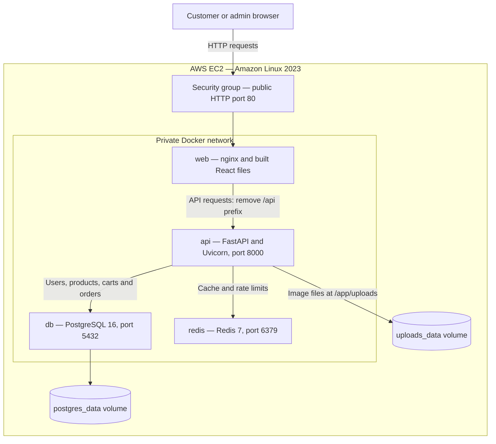
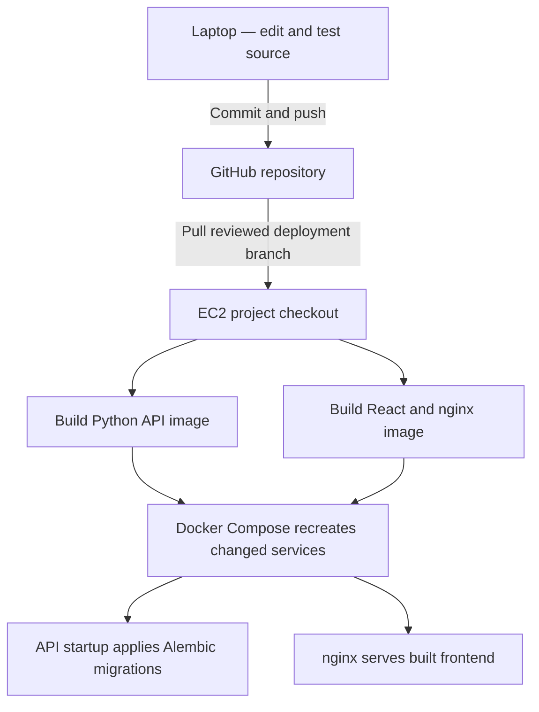

# QuickCart — AWS Deployment and Operations

> For normal use, start at “3. Connect from your laptop” below. Do not launch another instance, recreate secrets, or overwrite swap just to reopen the website.

## Architecture: how the running application works



React JavaScript runs in the visitor's browser. nginx delivers the built files and proxies API requests. Only nginx publishes an application port on the EC2 host; the database, Redis and API are reached inside Docker. SSH port 22 is separate administrative access to the host.

| Example request | Route and result |
|---|---|
| `GET /` | nginx returns the frontend HTML and assets |
| `GET /cart` | nginx returns the React app; React displays the cart page |
| `GET /api/products` | nginx forwards `/products` to FastAPI; FastAPI uses Redis/PostgreSQL |
| `POST /api/orders/checkout` | FastAPI validates authentication and checkout data, then writes the order transaction |
| `GET /api/docs` | FastAPI generates Swagger, which loads `/api/openapi.json` |

In the production Compose file, `UVICORN_ROOT_PATH=/api` supports the external prefix. `FORWARDED_ALLOW_IPS="*"` trusts forwarded headers in this private proxy arrangement; reconsider that trust if API access or network membership changes. nginx must overwrite the forwarded client headers.

### How code reaches AWS



GitHub stores source code. Docker images package executable code and dependencies. PostgreSQL records and uploaded image files live in separate persistent volumes. Pushing a commit does not automatically deploy this project; the current workflow requires a server pull and rebuild.

### Why local products are missing on AWS

Your laptop and EC2 are two separate computers with separate databases. Cloning the repository creates no copy of your local catalogue, accounts, orders, or uploaded files. Transfer both the required database records and their images, or create demonstration products again. See section 9 before importing anything.

## Setup reference: what was done already

This is a record for understanding and future rebuilds, not a command list to rerun on the existing server.

1. An EC2 instance was launched in `us-east-1`, with Amazon Linux 2023 and a `t3.micro` instance type. The root disk reported about 8 GiB; monitor free space because builds and backups consume it.
2. SSH access was configured with the new laptop key and regional EC2 Instance Connect access. A separate HTTP rule allows the website.
3. Docker and Git were installed, and Docker was enabled at boot:

```bash
sudo dnf install -y docker git
sudo systemctl enable --now docker
```

4. Docker Compose was installed separately as a system-wide CLI plugin. Version `v5.5.0` was confirmed during your deployment. Do not assume `dnf install docker` also installs Compose. For a new server, follow the official manual plugin installation instructions linked under References and select the correct release/architecture.
5. A 1 GiB swap file was created and enabled. Reboot persistence has not been confirmed. Swap can help with memory pressure but does not guarantee successful builds.
6. The GitHub repository was cloned into `/home/ec2-user/quickcart-backend`, using branch `feature/aws-deployment`.
7. A private `.env.prod` file was created. Its variables are `POSTGRES_USER`, `POSTGRES_PASSWORD`, `POSTGRES_DB`, `JWT_SECRET_KEY`, and optional `SITE_ADDRESS` for future HTTPS. The current database URL requires a URL-safe password; the setup used random hexadecimal characters. Do not change an initialized database's password by merely editing this file.
8. API and frontend images were built separately, then started with the standalone production Compose file. API startup ran Alembic migrations.
9. Health and readiness returned HTTP 200, with PostgreSQL and Redis reported up.

For a genuinely new server, clone the correct branch with:

```bash
git clone --branch feature/aws-deployment --single-branch https://github.com/MohdAsif-AIML25/quickcart-backend.git
cd quickcart-backend
```

On the existing server, use `cd ~/quickcart-backend` instead. Do not clone another nested copy.

Before building a new setup, fill `.env.prod` privately using `.env.prod.example` as the template, then verify:

```bash
chmod 600 .env.prod
git check-ignore .env.prod
sudo docker compose -f docker-compose.prod.yml --env-file .env.prod config --quiet
```

Never overwrite the existing `.env.prod` during a routine update. Avoid sharing unrestricted `docker compose config` output because it can contain resolved secrets. The `--quiet` form validates without displaying the configuration.

## Reading this guide

Every operational command below says which computer or prompt it belongs to. Run commands one at a time; stop on an error rather than pasting the remaining steps. The original project files are authoritative if paths, services, or branches change later.

## 1. Your deployment

| Setting | Current value |
|---|---|
| Instance name | quickcart-demo |
| Instance ID | i-0800f01a20ffa48f1 |
| Region | us-east-1 |
| OS / user | Amazon Linux 2023 / ec2-user |
| Instance type | t3.micro |
| Public IP at time of writing | 34.235.123.254 |
| AWS project folder | /home/ec2-user/quickcart-backend |
| Laptop project folder | D:\AI_Career\Pillar_2_Portfolio_Projects\prodcution_e_commerce\quickcart-backend |
| Deployment branch | feature/aws-deployment |
| Compose file | docker-compose.prod.yml (standalone stack) |
| Server configuration | .env.prod (private; never commit) |
| Services | web, api, db, redis |

Public frontend: http://34.235.123.254/

Public Swagger: http://34.235.123.254/api/docs

Schema: http://34.235.123.254/api/openapi.json

The auto-assigned public IP can change after an EC2 stop/start. Check the instance's current IP before using these commands or links.

## 2. Know which terminal you are using

| Prompt | Where you are | What you run |
|---|---|---|
| `PS C:\...>` | Windows PowerShell on laptop | ssh, scp, local Git commands |
| `[ec2-user@... ~]$` | AWS Linux home folder | cd, Docker, server Git commands |
| `[ec2-user@... quickcart-backend]$` | AWS project folder | Production Compose commands |
| `quickcart=#` or `quickcart=>` | PostgreSQL | SQL statements |

Copy only commands, not the prompt. Paste one command once, check it, then press Enter. If an unfinished shell command shows `>`, press Ctrl+C and retry. In psql, use `\q` to exit.

## 3. Connect from your laptop

Run in Windows PowerShell:

```powershell
ssh -i "$env:USERPROFILE\quickcart-aws-new" ec2-user@34.235.123.254
```

The private key stays on your laptop. Never paste its contents into chat, commit it, or copy it into the application.

After connecting, run in AWS Linux:

```bash
cd ~/quickcart-backend
```

Alternative: AWS Console → EC2 → quickcart-demo → Connect → EC2 Instance Connect. Choose the public IP and username `ec2-user`.

## 4. Security group rules

Security group: `sg-05057ce3f5ebdbadc` (launch-wizard-1).

| Type | Port | Source | Purpose |
|---|---|---|---|
| SSH | 22 | My IP, ending in /32 | Laptop SSH access |
| SSH | 22 | EC2 Instance Connect range for this region | AWS browser terminal |
| HTTP | 80 | 0.0.0.0/0 | Public website |

The console showed `18.206.107.24/29` for Instance Connect during setup. Verify the currently advertised regional range when configuring it again. The laptop IP is dynamic: select My IP again when your internet connection changes.

Keep all three rules separate. Do not replace SSH with HTTP. Do not expose PostgreSQL 5432, Redis 6379, or the API's 8000 port. Add HTTPS 443 when HTTPS is actually configured.

## 5. Daily health checks

Run these in AWS Linux, from `~/quickcart-backend`:

```bash
sudo docker compose -f docker-compose.prod.yml --env-file .env.prod ps
```

```bash
curl -i --max-time 10 http://localhost/api/health
```

```bash
curl -i --max-time 10 http://localhost/api/health/ready
```

Expected: HTTP 200; readiness reports database and Redis up. A running EC2 instance does not by itself prove the application is healthy.

View recent logs:

```bash
sudo docker compose -f docker-compose.prod.yml --env-file .env.prod logs --tail=100 api web
```

Check resources:

```bash
df -h /
```

```bash
free -h
```

```bash
sudo swapon --show
```

A 1 GiB swap file was enabled during setup. Persistence across reboot has not been confirmed; check it after reboot. Do not overwrite an active swap file.

## 6. Start, restart, and stop the application

Start with already-built images:

```bash
sudo docker compose -f docker-compose.prod.yml --env-file .env.prod up -d --no-build
```

Restart an existing API container:

```bash
sudo docker compose -f docker-compose.prod.yml --env-file .env.prod restart api
```

Restart does not apply edited source code or new Compose environment settings. Use the deployment steps below for changes.

Stop the application only when you want the website offline:

```bash
sudo docker compose -f docker-compose.prod.yml --env-file .env.prod stop
```

Closing VS Code, Docker Desktop, PowerShell, or your laptop does not stop Docker on EC2. Stopping containers does not stop EC2 billing.

Do not use `docker compose down -v` or volume-pruning commands as a troubleshooting shortcut: database and upload volumes contain your data.

## 7. Safe access through an SSH tunnel

Until HTTPS is configured, use the encrypted SSH tunnel for entering credentials or personal information. In a separate Windows PowerShell window:

```powershell
ssh -i "$env:USERPROFILE\quickcart-aws-new" -N -o ExitOnForwardFailure=yes -L 127.0.0.1:8080:127.0.0.1:80 ec2-user@34.235.123.254
```

No output is normal. Leave that window open.

- Frontend: http://127.0.0.1:8080/
- Swagger: http://127.0.0.1:8080/api/docs
- Schema: http://127.0.0.1:8080/api/openapi.json

Use `127.0.0.1` explicitly. During this session, `localhost` reached an IPv6 listener and Swagger requested the wrong schema path. Closing this tunnel only disables these local links; the public AWS website can continue running.

## 8. Create and verify an admin

First register a new account through the frontend or POST `/auth/register`. Choose your own unique password and store it privately. Registration normally creates a customer account.

Then, in AWS Linux:

```bash
cd ~/quickcart-backend
```

```bash
sudo docker compose -f docker-compose.prod.yml --env-file .env.prod exec db sh -c 'psql -U "$POSTGRES_USER" -d "$POSTGRES_DB"'
```

Wait for the PostgreSQL prompt. Run SQL there, not at the Linux prompt. Replace the email if you registered a different account:

```sql
UPDATE users
SET role = 'admin'
WHERE email = 'admin@example.com'
RETURNING id, email, role;
```

`UPDATE 1` means one account was updated. `UPDATE 0` means no matching account exists; register or check the email first. If a table/column error appears, stop and inspect the schema before changing the command.

Check:

```sql
SELECT id, email, role
FROM users
WHERE email = 'admin@example.com';
```

Exit:

```text
\q
```

Log out and log in again. In Swagger, Authorize → Logout → enter the email as username and the existing password. Leave client_id and client_secret empty. GET `/auth/me` should show `admin`.

Promotion does not change the password. The development `scripts.promote_admin` script refuses production use. Password hashes cannot be read back as original passwords.

## 9. Code, configuration, and data are separate

| Item | Transfer method | GitHub? |
|---|---|---|
| app/, frontend/, migrations, Dockerfiles | Git push/pull and Docker rebuild | Yes |
| .env.prod | Create/manage privately on AWS | No |
| Products, users, carts, orders | PostgreSQL export/import | No |
| Uploaded image files | Copy to the actual uploads volume | Usually no |
| QuickCart_Product_Images/ | Optional source image collection | Only if appropriate to share |
| Private SSH keys, database backups | Secure private storage | No |
| .venv/, node_modules/ | Recreated by installs/builds | No |

AWS has its own PostgreSQL and uploads volumes. Git clone does not copy local database records. Adding source images to GitHub does not link them to products automatically.

Local product/image transfer is pending. Identify the local DB location and actual upload storage first. Back up AWS before import. A whole-database restore can replace new AWS accounts and orders; a catalogue-only migration should preserve those and handle product ID conflicts and image paths explicitly.

## 10. Back up before a deployment or data import

Run in AWS Linux from the project folder. These commands create private, dated backup files outside the Git repo:

```bash
umask 077
mkdir -p ~/quickcart-backups
backup_stamp=$(date +%Y%m%d-%H%M%S)
```

```bash
sudo docker compose -f docker-compose.prod.yml --env-file .env.prod exec -T db sh -c 'pg_dump -U "$POSTGRES_USER" -d "$POSTGRES_DB" -Fc' > "$HOME/quickcart-backups/database-$backup_stamp.dump"
```

Only if the dump command succeeds, inspect its archive directory:

```bash
sudo docker compose -f docker-compose.prod.yml --env-file .env.prod exec -T db pg_restore --list < "$HOME/quickcart-backups/database-$backup_stamp.dump"
```

Back up the uploaded image directory mounted inside the API container:

```bash
sudo docker compose -f docker-compose.prod.yml --env-file .env.prod exec -T api tar -C /app -czf - uploads > "$HOME/quickcart-backups/uploads-$backup_stamp.tar.gz"
```

```bash
tar -tzf "$HOME/quickcart-backups/uploads-$backup_stamp.tar.gz"
```

These checks verify readable archives, not a full successful restore. Take backups during a quiet period with no uploads or catalogue changes for consistency. Keep a secure off-server copy too; a backup on the same disk does not protect against disk loss. Do not restore over production without reviewing what will be replaced and testing restore separately.

## 11. Deploy later code changes

First test the change locally and commit/push it to the intended deployment branch. Do not upload `.env`, passwords, keys, or backups.

On AWS, back up first and check:

```bash
cd ~/quickcart-backend
git status
git branch --show-current
git log -1 --oneline
```

Continue only if the branch is the intended one and the working tree has no unexplained edits. Current branch is `feature/aws-deployment`; revise this runbook if you later deploy main. Review the incoming changes and migrations on GitHub before pulling.

```bash
git pull --ff-only origin feature/aws-deployment
```

```bash
sudo docker compose -f docker-compose.prod.yml --env-file .env.prod config --quiet
```

No output on successful config validation is normal. Build one image at a time on this small instance. Continue only when each command succeeds:

```bash
sudo docker compose -f docker-compose.prod.yml --env-file .env.prod build api
```

```bash
sudo docker compose -f docker-compose.prod.yml --env-file .env.prod build web
```

```bash
sudo docker compose -f docker-compose.prod.yml --env-file .env.prod up -d --no-build
```

Repeat the health checks from section 5, then test login, catalogue, images, cart, and checkout. The deployed API startup command runs `alembic upgrade head`; review new migrations before deploying. A Git checkout alone does not roll back a database migration. Preserve the previous commit identifier and backups before updating.

## 12. Troubleshooting reminder

| Symptom | Check / next action |
|---|---|
| `.env.prod` not found | Run `cd ~/quickcart-backend`; do not create another env file in home |
| `UPDATE: command not found` | You are in Bash; enter psql before running SQL |
| SSH timeout | Check current EC2 IP/state and port 22 source rules |
| PowerShell works, browser terminal fails | Check Instance Connect regional source rule and ec2-user username |
| SSH Permission denied (publickey) | Check username, selected private key, and authorized_keys; timeout is a different problem |
| Website times out | Check HTTP 80 rule, current public IP, then container status |
| Swagger parser error with HTML | Check schema request URL; it must use /api/openapi.json, returning JSON |
| `/api/docs.` gives 404 | Remove the trailing dot |
| Email already registered (409) | Log in; don't register the same email again |
| Token expired (401) | Swagger Authorize → Logout → authorize again |
| Admin endpoint forbidden (403) | GET /auth/me; confirm role and account |
| Product images absent | Check image_url and actual uploaded file; GitHub source images alone are insufficient |
| AWS catalogue empty | AWS DB is separate from local DB; migrate or create products |
| Input repeats / unfinished `>` prompt | Ctrl+C in shell, paste one command once; use working PowerShell SSH if needed |

## 13. Ending a work session and costs

- To keep the website live: leave EC2 running; close laptop apps normally.
- To take the demo offline: AWS Console → EC2 → Instance state → Stop instance. Do not choose Terminate for a temporary pause.
- Stopping EC2 does not remove all possible costs: EBS storage and other retained resources can still incur charges.
- After starting again, check the public IP, Docker service, containers, readiness, and swap.
- Check Billing/Free Tier or credits and configure budget alerts. Do not assume this deployment is guaranteed free; alerts do not automatically stop spending.

## 14. Remaining tasks

- [ ] Confirm the new admin account exists and GET /auth/me reports admin.
- [ ] Confirm the old exposed SSH key has been removed from authorized_keys after the new key works.
- [ ] Transfer the local catalogue and uploaded images without overwriting AWS users/orders.
- [ ] Configure domain and HTTPS using the project's deployment guide and HTTPS Compose file.
- [ ] Verify database and image backups; test recovery separately.
- [ ] Configure billing alerts and review credit usage.
- [ ] Confirm swap behavior after reboot.
- [ ] Complete one customer purchase and verify it as admin.

## 15. Store this guide in Git

Save this file on your laptop as `quickcart-backend/docs/aws-deployment.md`, replacing the old Ubuntu guide. Review the diff before committing.

Windows PowerShell, after saving:

```powershell
cd "D:\AI_Career\Pillar_2_Portfolio_Projects\prodcution_e_commerce\quickcart-backend"
git status
git branch --show-current
git add -- docs/aws-deployment.md
git diff --cached --check
git diff --cached --stat
```

Review staged files before committing; ensure only intended files are included:

```powershell
git commit -m "docs: align AWS guide with Amazon Linux deployment"
git push
```

If push reports no upstream, follow the command Git suggests for the branch you intend to publish. These commands have not been run on your laptop by this guide.

## 16. Test the deployed shop

Use your SSH tunnel until HTTPS is configured when entering credentials. Swagger and the frontend access the same AWS database when both URLs point to this EC2 instance.

1. Register a customer with a unique demo email; authorize it and run GET `/auth/me`.
2. Register and promote a separate admin using section 8; verify its role.
3. As admin, create a product and upload a JPEG, PNG, or WebP using POST `/admin/products/{product_id}/image` (the documented limit is 2 MB).
4. Confirm the product and image appear in the frontend and GET `/products`.
5. As customer, add stock-available products to the cart and inspect GET `/cart`.
6. Use the frontend checkout form to provide the delivery address and Cash on Delivery payment method. If using Swagger, follow the currently deployed request schema; the old no-body checkout examples predate the new checkout fields.
7. Confirm your order appears in the customer's order history, stock decreases, and the cart empties.
8. As admin, confirm the same order appears in all orders. Verify any status/delete controls against the deployed Swagger definitions; their exact routes were not supplied in this session.

A `confirmed` order with COD does not prove that money was collected. This project currently has no integrated online payment gateway. Delivery dates and order status should be interpreted according to the implemented application rules.

## 17. HTTPS and future improvements

HTTPS is not yet demonstrated as configured. The repository has `docker-compose.https.yml`; read it, its Caddy configuration, and required variables before enabling it. A typical next step is to point a domain at the current server, set `SITE_ADDRESS`, allow 443, and deploy the HTTPS stack. Do not blindly run a second service on port 80 alongside nginx's existing host binding.

For this demo, the database and application share one server and disk. Future options include managed PostgreSQL with backups, shared object storage for images, centralized logs, and automated deployments. These are optional changes with their own costs and operational requirements, not prerequisites for understanding the current deployment.

## References

- Docker Compose manual plugin installation: https://docs.docker.com/compose/install/linux/#install-the-plugin-manually
- AWS SSH troubleshooting: https://docs.aws.amazon.com/AWSEC2/latest/UserGuide/TroubleshootingInstancesConnecting.html
- AWS stopping and starting EC2: https://docs.aws.amazon.com/AWSEC2/latest/UserGuide/Stop_Start.html
- AWS instance lifecycle and retained resource charges: https://docs.aws.amazon.com/AWSEC2/latest/UserGuide/ec2-instance-lifecycle.html
- Docker Compose restart behavior: https://docs.docker.com/reference/cli/docker/compose/restart/
- Docker Compose up: https://docs.docker.com/reference/cli/docker/compose/up/

Project-specific paths and settings come from the files and terminal output shared during your deployment. No passwords, tokens, or private key contents are included in this guide.
